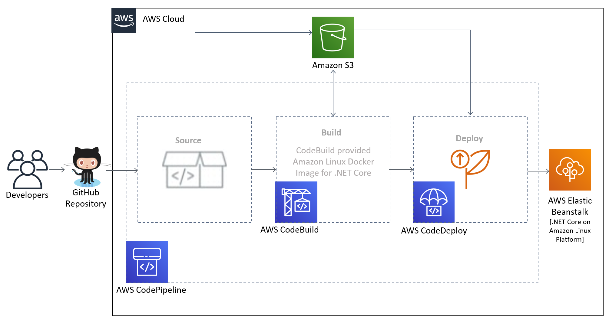

Deploying this Quick Start with
default parameters builds the following {partner-product-name} environment in the
AWS Cloud.

:xrefstyle: short
[#architecture1]
.Quick Start architecture for {partner-product-short-name} on AWS

As shown in <<architecture1>>, the Quick Start sets up the following:

* An S3 bucket for holding artifacts.
* An Elastic Beanstalk environment that acts as the target when the application's latest build package is deployed.
* A CI/CD pipeline with source, build, and deploy stages.

The source stage invokes CodePipeline every time the code changes in the configured GitHub repository branch. This stage configures GitHub, which integrates the application source code via webhooks. It then fetches the latest GitHub code and places it in an S3 bucket in the `Source Artifacts` directory.

The build stage invokes CodeBuild, which fetches the source code from the S3 bucket. The CodeBuild-provided Amazon Linux 2 Docker image for .NET Core compiles the latest source code using the steps provided in the associated `BuildSpec.yml` file. The resulting build package is placed in the `Build Artifacts` directory in the S3 bucket.

The deploy stage invokes CodeDeploy to fetch the build package from the S3 bucket and deploy it to the Elastic Beanstalk environment.

